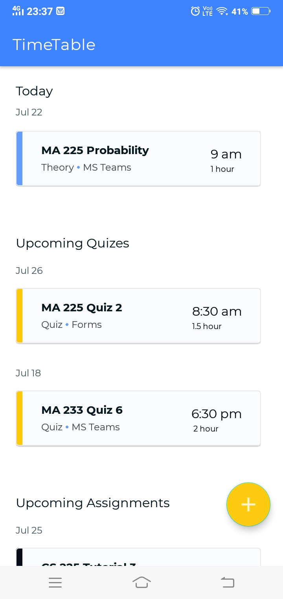
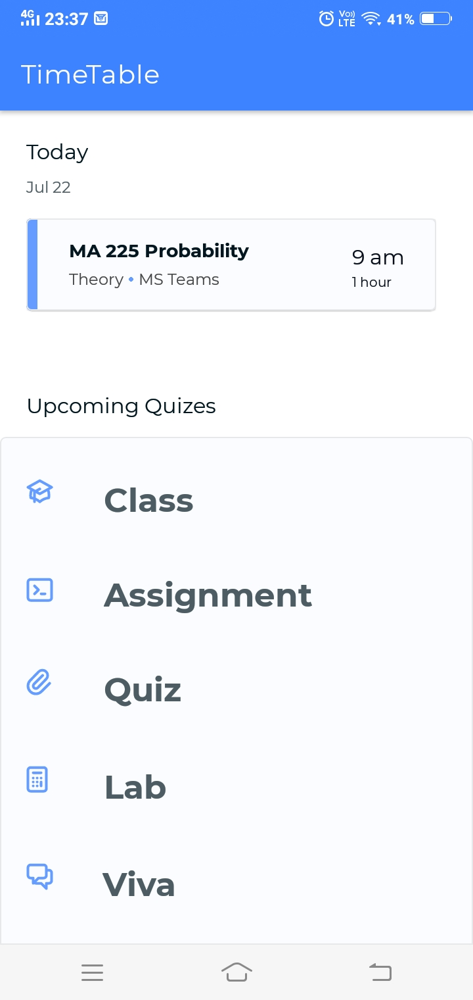
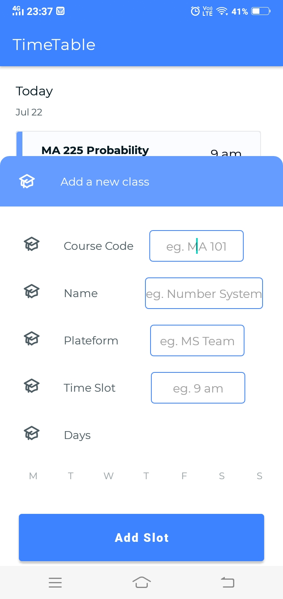
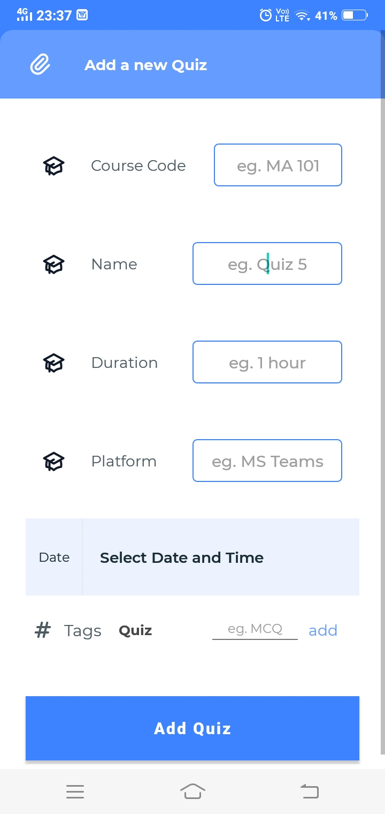

# Integration_TimeTable
Feature for students to create/edit class/quiz/assignment/lab/viva.  
The BR is further notified to accept the request or reject it.    
---

<table>
  <tr>
    <td></td>
    <td></td>
    <td></td>
  </tr>
  <tr>
    <td></td>
  </tr>
 </table>
